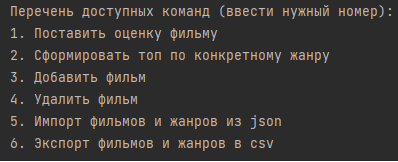

# Итоговый проект курса по Java 

## Что за проект?

Вариант 20, работа с кинотеатром. Задание звучит так:

Реализовать приложение, формирующее списки фильмов (топ 5, топ 10, топ 100) для просмотра по определенному жанру. 
Приложение должно поддерживать добавление оценок к фильмам пользователями. Пользователь
может поставить только одну оценку фильму и впоследствии ее изменить, если
необходимо. Жанры, фильмы, оценки, пользователи должны сохраняться в БД.
Реализовать импорт жанров и фильмов из JSON-файла. Реализовать механизм
экспорта жанров, фильмов в CSV-файлы.

## Какие зависимости используются?

Перечень используемых библиотек:
1. h2-2.1.214
2. angus-activation-1.0.0
3. jackson-annotations-2.13.4
4. jackson-core-2.13.4
5. jackson-databind-2.13.4

Все зависимости из перечня разрешённых к подключению в финальном проекте.

## Как запускать программу?

Запуск следует производить из среды разработки Intellij Idea. Метод main() находится в файле
src/ru/croc/project/Project.java. Перед непосредственно запуском необходимо запустить БД в режиме сервера.
Для запуска с правами администратора в последней версии БД был создан пользователь user0, обладающий такими правами.
Необходимо ввести user0, когда система просит ввести имя пользователя для получения этих прав.

## Функционал приложения

Перед главным меню пользователю необходимо ввести логин, чтобы войти в систему. После этого можно вводить команды.

Всего система поддерживает 6 комманд. Последние 4 из них доступны только для администраторов.

Пользовательский интерфейс приведён к такому виду, чтобы пользователь мог в любой момент времени понять,
как взаимодействовать с системой на конкретном этапе.

## Описание работы программы

В классе Project описана логика работы пользовательского интерфейса.
Все доступные команды пользователь видит в командной строке.
В зависимости от того, имеет ли пользователь права администратора, в меню
отображаются или нет дополнительные варианты взаимодействия с системой.

Классы сущностей, необходимых для реализации системы, находятся
в директории models.

Для взаимодействия с БД реализованы отдельные DАO классы, описанные
в директории dаo.

Класс DataSource реализует паттерн одиночка для того, чтобы иметь одну
точку доступа к бд и не плодить лишние подключения.

Класс AuthProvider обеспечивает процесс логина в систему пользователя.

Класс CommandFilter обеспечивает проверку корректности введённой команды для текущего
пользователя.

В директориях exporters и importers описаны классы для импорта и экспорта данных в необходимые форматы.

Помимо всего прочего, под покрыт комментариями, что может помочь при его проверке.